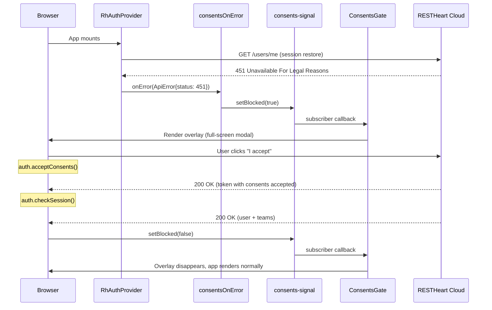

# Architecture Overview

This page explains how the application boots, authenticates users, routes requests, gates unconfigured deployments, and enforces consents acceptance.

## Component Tree

```
<StrictMode>
  <BrowserRouter>
    <RhAuthProvider config={{ apiBaseUrl, onError: consentsOnError }}>
      <App />                     ← fragment token capture + config gate
        ├── <ConfigPage />        ← if apiUrl is invalid
        └── <ConsentsGate>        ← blocking overlay if 451
              └── useRoutes(routes)   ← React Router route tree
                    ├── PublicGuard → Login / Signup / Verify / ForgotPassword / ResetPassword
                    ├── Accept (no guard — works signed-in or out)
                    └── AuthGuard → Shell (authenticated frame)
                          └── <Outlet /> → Home / Teams / NewTeam / TeamDetail / Account
```

The entrypoint is `src/main.tsx`, which renders `<RhAuthProvider>` from `@restheart-cloud/kit-react` wrapping the entire app. The provider receives `onError: consentsOnError` so that HTTP 451 responses trigger the consents gate (see [Consents Gate](#consents-gate)). The provider manages auth state (user, teams, tokens) and exposes it via the [`useAuth()` hook](/openwiki/domain/auth-and-teams.md).

## Auth Provider

`RhAuthProvider` receives `config={{ apiBaseUrl: environment.apiUrl, onError: consentsOnError }}` and provides:

### Properties

- **`auth.user`** — the authenticated user object (with `profile.name`, `profile.surname`, `_id`)
- **`auth.teams`** — array of `TeamMembership` objects (each with `id.$oid`, `name`, `role`, `active`)
- **`auth.isAuthenticated`** — boolean indicating whether the user is currently signed in

### Authentication

- **`auth.login(email, password)`** — email/password login
- **`auth.logout()`** — sign out
- **`auth.register({ teamName, firstName, lastName, email, password })`** — create account and default team
- **`auth.checkSession()`** — validate current session, returns user or null
- **`auth.forgotPassword(email)`** — request password reset email
- **`auth.resetPassword({ email, token, password })`** — set new password with reset token
- **`auth.verify(email, token)`** — verify email address, returns redirect URL

### Invitations

- **`auth.activate({ email, token, password })`** — activate new user from invitation
- **`auth.acceptInvite(token)`** — accept invitation for existing user
- **`auth.getInvitation(email, token)`** — fetch invitation details

### Team Management

- **`auth.loadTeams()`** — fetch team memberships, returns the updated array
- **`auth.switchTeam(teamId)`** — switch active team
- **`auth.createTeam(name)`** — create a new team
- **`auth.updateTeam({ name, description })`** — update team settings
- **`auth.deleteTeam()`** — delete the active team (owner only, no members remaining)
- **`auth.listTeamMembers()`** — list members of the active team
- **`auth.listInvitations()`** — list pending invitations for the active team
- **`auth.invite(email, role)`** — send team invitation
- **`auth.resendInvite(email)`** — resend a pending invitation
- **`auth.removeMember(email)`** — remove a member from the active team
- **`auth.updateMemberRole(email, role)`** — change a member's role

### User Profile

- **`auth.updateProfile({ firstName, lastName })`** — update user profile
- **`auth.changePassword(currentPassword, newPassword)`** — change password

### Data Access

- **`auth.api(path)`** — authenticated `fetch` wrapper; attaches the bearer token automatically and rejects non-2xx responses as `ApiError({ status, message })`. Use this for your app's own collections — see [Auth & Teams](/openwiki/domain/auth-and-teams.md#reading-your-own-data).

### Consents

- **`auth.acceptConsents()`** — record the user's acceptance of the current Terms of Service and Privacy Policy. The server stamps the versions and timestamp via its permission's `mergeRequest`; the client sends no version data.

Token management (`setToken`, `scheduleRefresh`) is also provided by the kit and is called during [fragment token capture](#fragment-token-capture).

## Routing Strategy

Routes are defined in `src/routes.tsx` using React Router v6's `RouteObject[]` array with `useRoutes()`. Key design decisions:

### Lazy Loading

Every page component is imported with `lazy()` and wrapped in a `<Suspense fallback={null}>`. This produces one chunk per page:

```typescript
const Login = lazy(() => import('./pages/auth/login/Login'));
const Shell = lazy(() => import('./pages/shell/Shell'));
// ... etc
```

### Feature-Flag Gating

Routes are conditionally included in the array based on [feature flags](/openwiki/domain/auth-and-teams.md#feature-flags) from `src/environments/environment.ts`:

```typescript
const { emailRegistration, passwordReset, oauthLogin, teamInvitations } = environment.features;

// Signup route only if email registration or OAuth is enabled
...(emailRegistration || oauthLogin ? [{ path: 'auth/signup', ... }] : []),
// Password reset routes only if passwordReset is enabled
...(passwordReset ? [{ path: 'auth/forgot-password', ... }, { path: 'auth/reset-password', ... }] : []),
// Invitation route only if teamInvitations is enabled
...(teamInvitations ? [{ path: 'invitations/accept', ... }] : []),
```

A flag that is `false` removes both the route and the corresponding UI (links, buttons) from the app.

### Route Guards

| Guard | Behavior |
|-------|----------|
| `PublicGuard` | Renders children only when the user is **not** authenticated; redirects to `/` if already logged in |
| `AuthGuard` | Renders children only when the user **is** authenticated; redirects to `/auth/login` if not |

`Accept` (invitation page) has **no guard** — it works whether the user is signed in or out, which is required because invitation links are opened from email.

### Catch-All

`{ path: '*', element: <Home /> }` redirects any unknown path to the home page (which itself is behind `AuthGuard`).

## Fragment Token Capture

After an OAuth redirect, the auth provider returns the access token in the URL **fragment** (`#access_token=...`). `App.tsx` calls `consumeFragmentToken()` on mount:

1. Reads `window.location.hash`
2. Extracts `access_token` from the fragment parameters
3. Calls `setToken(accessToken)` and `scheduleRefresh({ apiBaseUrl })`
4. Also checks for `?flow=signup` query param and sets the `justSignedUp` flag
5. Cleans the URL with `history.replaceState` to remove the hash and query params

This runs once on app load, before any route renders.

## Config Gating

`App.tsx` validates `environment.apiUrl` with `isValidApiBaseUrl()` from the kit. If the URL is not a valid `*.restheart.com` address:

- A `<ConfigPage>` is rendered instead of the route tree
- An error is logged to the console
- The app is effectively locked until `apiUrl` is fixed

This prevents confusing failures when someone clones the repo but forgets to configure the service URL.

## Consents Gate

The consents gate is an overlay system that blocks the entire application when the server rejects requests with HTTP `451` (Unavailable For Legal Reasons). It consists of three files:

### `src/consents-signal.ts` — Pub/Sub Flag

A module-level boolean (`blocked`) with a simple pub/sub API:

- **`isBlocked()`** — returns the current flag value
- **`setBlocked(next)`** — updates the flag and notifies all subscribers
- **`subscribe(listener)`** — registers a callback; returns an unsubscribe function
- **`consentsOnError(err)`** — the critical hook: passed to `RhAuthProvider` as `config.onError`. When any API call returns status `451`, this function calls `setBlocked(true)`.

The `consentsOnError` callback is the only place that detects the 451 condition. Session restoration happens inside the provider and its failures are absorbed internally, so without this callback the app cannot distinguish "blocked by consents" from "not signed in."

### `src/ConsentsGate.tsx` — Blocking Overlay

A React component that wraps the route tree. It subscribes to the consents signal on mount and renders:

- **When not blocked:** passes children through unchanged (zero overhead).
- **When blocked:** renders a full-screen modal overlay (`role="dialog"`, `aria-modal="true"`) with:
  - Two checkboxes: Terms of Service and Privacy Policy (both must be checked to enable the accept button)
  - An "I accept" button that calls `auth.acceptConsents()` then `auth.checkSession()` to refresh the session
  - A "Sign out" button that clears the blocked flag and calls `auth.logout()`

The overlay has no close button and no backdrop-click dismiss — the only exits are accepting consents or signing out.

### `src/ConsentsGate.css` — Overlay Styles

Fixed positioning at `z-index: 400` (above the header at 100, dropdowns at 200, and navigation progress at 300). Semi-transparent backdrop with a centered card.

### Why ConsentsGate Sits Above AuthGuard

The placement in the component tree is deliberate. A blocked user has no valid session — the server's Guards rule refuses `/users/me` with `451` just like every other request. If `ConsentsGate` were inside the router, `AuthGuard` would see an unauthenticated user and redirect to the login page. The user would never see the consents acceptance screen. By placing `ConsentsGate` above `useRoutes()`, the overlay renders regardless of auth state.

### 451 Status Code Flow



The consents gate flow: the server's Guards rule blocks all requests from users who have not accepted the current Terms of Service and Privacy Policy. The client detects the 451 via `consentsOnError`, raises the overlay, and after acceptance refreshes the session so the app starts with a valid user.

### Server-Side Enforcement

The overlay is purely a user-experience convenience. The enforcement rule lives on the server as a Guards rule. Removing the overlay via browser dev tools does not bypass the block — every API request still returns `451`. The client sends no version information; the server's permission `mergeRequest` stamps the current versions and timestamp when `auth.acceptConsents()` is called.

## See Also

- [Auth & Teams](/openwiki/domain/auth-and-teams.md) — detailed auth flows, team management, and feature flag definitions
- [Operations & Runbook](/openwiki/operations/runbook.md) — how to configure `environment.ts` and the styling system
- [Source Map](/openwiki/source-map.md) — file-by-file inventory
