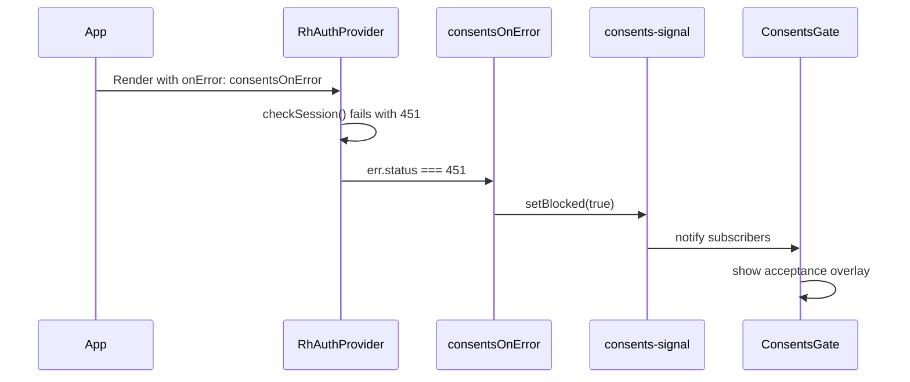

# Architecture Overview

This page explains how the application boots, authenticates users, routes requests, gates unconfigured deployments, and handles consents blocking.

## Component Tree

<!-- openwiki: mermaid parse failed and this diagram was converted to a text fence so it does not break rendering. Fix the diagram source and restore the mermaid fence. Parser error: Heuristic: an unescaped angle bracket inside a label breaks rendering; rephrase the label. -->
```text
graph TD
    A[StrictMode] --> B[BrowserRouter]
    B --> C[RhAuthProvider<br/>config: apiBaseUrl + onError]
    C --> D[ConsentsGate]
    D --> E[useRoutes]
    E --> F[PublicGuard routes]
    E --> G[Accept route<br/>no guard]
    E --> H[AuthGuard routes]
    H --> I[Shell]
    I --> J[Outlet]
    J --> K[Home / Teams / Account]

    style D fill:#ff9,stroke:#333
    style F fill:#9f9,stroke:#333
    style G fill:#9cf,stroke:#333
    style H fill:#f96,stroke:#333
```

The three-layer nesting is: `StrictMode` > `BrowserRouter` > `RhAuthProvider` > `ConsentsGate` > `useRoutes(routes)`.

The entrypoint is `src/main.tsx`, which renders `<RhAuthProvider>` from `@restheart-cloud/kit-react` wrapping the entire app. This provider manages auth state (user, teams, tokens) and exposes it via the [`useAuth()` hook](../domain/auth-and-teams.md).

## Auth Provider

`RhAuthProvider` receives `config={{ apiBaseUrl: environment.apiUrl, onError: consentsOnError }}` and provides:

### Properties

- **`auth.user`** — the authenticated user object (with `profile.name`, `profile.surname`, `_id`)
- **`auth.teams`** — array of `TeamMembership` objects (each with `id.$oid`, `name`, `role`, `active`)
- **`auth.isAuthenticated`** — boolean indicating whether the user is currently signed in

### Authentication

- **`auth.login(email, password)`** — email/password login
- **`auth.logout()`** — sign out
- **`auth.register({ teamName, firstName, lastName, email, password })`** — create account and default team
- **`auth.checkSession()`** — validate current session, returns user or null
- **`auth.forgotPassword(email)`** — request password reset email
- **`auth.resetPassword({ email, token, password })`** — set new password with reset token
- **`auth.verify(email, token)`** — verify email address, returns redirect URL

### Invitations

- **`auth.activate({ email, token, password })`** — activate new user from invitation
- **`auth.acceptInvite(token)`** — accept invitation for existing user
- **`auth.getInvitation(email, token)`** — fetch invitation details

### Team Management

- **`auth.loadTeams()`** — fetch team memberships, returns the updated array
- **`auth.switchTeam(teamId)`** — switch active team
- **`auth.createTeam(name)`** — create a new team
- **`auth.updateTeam({ name, description })`** — update team settings
- **`auth.deleteTeam()`** — delete the active team (owner only, no members remaining)
- **`auth.listTeamMembers()`** — list members of the active team
- **`auth.listInvitations()`** — list pending invitations for the active team
- **`auth.invite(email, role)`** — send team invitation
- **`auth.resendInvite(email)`** — resend a pending invitation
- **`auth.removeMember(email)`** — remove a member from the active team
- **`auth.updateMemberRole(email, role)`** — change a member's role

### User Profile

- **`auth.updateProfile({ firstName, lastName })`** — update user profile
- **`auth.changePassword(currentPassword, newPassword)`** — change password

### Data Access

- **`auth.api(path)`** — authenticated `fetch` wrapper; attaches the bearer token automatically and rejects non-2xx responses as `ApiError({ status, message })`. Use this for your app's own collections — see [Auth & Teams](../domain/auth-and-teams.md#reading-your-own-data).

### Consents Management

- **`auth.acceptConsents()`** — accept current Terms of Service and Privacy Policy; the server stamps versions and timestamp via the permission's `mergeRequest`
- **`auth.checkSession()`** — after accepting consents, reloads the session so the app gets a user and their teams

Token management (`setToken`, `scheduleRefresh`) is also provided by the kit and is called during [fragment token capture](#fragment-token-capture).

## Routing Strategy

Routes are defined in `src/routes.tsx` using React Router v6's `RouteObject[]` array with `useRoutes()`. Key design decisions:

### Lazy Loading

Every page component is imported with `lazy()` and wrapped in a `<Suspense fallback={null}>`. This produces one chunk per page:

```typescript
const Login = lazy(() => import('./pages/auth/login/Login'));
const Shell = lazy(() => import('./pages/shell/Shell'));
// ... etc
```

### Feature-Flag Gating

Routes are conditionally included in the array based on [feature flags](../domain/auth-and-teams.md#feature-flags) from `src/environments/environment.ts`:

```typescript
const { emailRegistration, passwordReset, oauthLogin, teamInvitations } = environment.features;

// Signup route only if email registration or OAuth is enabled
...(emailRegistration || oauthLogin ? [{ path: 'auth/signup', ... }] : []),
// Password reset routes only if passwordReset is enabled
...(passwordReset ? [{ path: 'auth/forgot-password', ... }, { path: 'auth/reset-password', ... }] : []),
// Invitation route only if teamInvitations is enabled
...(teamInvitations ? [{ path: 'invitations/accept', ... }] : []),
```

A flag that is `false` removes both the route and the corresponding UI (links, buttons) from the app.

### Route Guards

| Guard | Behavior |
|-------|----------|
| `PublicGuard` | Renders children only when the user is **not** authenticated; redirects to `/` if already logged in |
| `AuthGuard` | Renders children only when the user **is** authenticated; redirects to `/auth/login` if not |

`Accept` (invitation page) has **no guard** — it works whether the user is signed in or out, which is required because invitation links are opened from email.

### Catch-All

`{ path: '*', element: <Home /> }` redirects any unknown path to the home page (which itself is behind `AuthGuard`).

## Fragment Token Capture

After an OAuth redirect, the auth provider returns the access token in the URL **fragment** (`#access_token=...`). `App.tsx` calls `consumeFragmentToken()` on mount:

1. Reads `window.location.hash`
2. Extracts `access_token` from the fragment parameters
3. Calls `setToken(accessToken)` and `scheduleRefresh({ apiBaseUrl })`
4. Also checks for `?flow=signup` query param and sets the `justSignedUp` flag
5. Cleans the URL with `history.replaceState` to remove the hash and query params

This runs once on app load, before any route renders.

## Config Gating

`App.tsx` validates `environment.apiUrl` with `isValidApiBaseUrl()` from the kit. If the URL is not a valid `*.restheart.com` address:

- A `<ConfigPage>` is rendered instead of the route tree
- An error is logged to the console
- The app is effectively locked until `apiUrl` is fixed

This prevents confusing failures when someone clones the repo but forgets to configure the service URL.

## Consents Gate Overlay

The `ConsentsGate` component sits above the router but below `RhAuthProvider` in the component tree. This placement is intentional and critical:

1. **Purpose**: When the RESTHeart Cloud service has a Guards rule blocking users who haven't accepted the current Terms of Service and Privacy Policy, it responds with HTTP `451` to all requests.
2. **Session problem**: `/users/me` is one of those blocked requests, so a blocked user has no session. If `ConsentsGate` were below the router, `AuthGuard` would see no session and redirect to the login page.
3. **Overlay behavior**: The gate replaces the entire app with an acceptance form containing checkboxes for Terms of Service and Privacy Policy, plus "I accept" and "Sign out" buttons.
4. **Signal mechanism**: The `consents-signal.ts` module provides a pub/sub system. `consentsOnError` is passed to `RhAuthProvider` as `config.onError` and raises the flag on any `451` response from the service.
5. **User experience**: The overlay is client-side UX, not enforcement. Removing it with dev tools doesn't bypass the block — the server rule still returns `451`.

### Signal Flow



The versions and timestamp of what is accepted are determined entirely by the server's Guards rule `mergeRequest` — bumping versions requires no change on the client side.

## See Also

- [Auth & Teams](../domain/auth-and-teams.md) — detailed auth flows, team management, and feature flag definitions
<!-- openwiki: broken internal link [../domain/consents-gate.md] file "../domain/consents-gate.md" does not exist. Fix the href or restore the target, then delete this comment. -->
- [Consents Gate](../domain/consents-gate.md) — server-side Guards rule and acceptance flow details
- [Operations & Runbook](../operations/runbook.md) — how to configure `environment.ts` and the styling system
- [Source Map](../source-map.md) — file-by-file inventory
