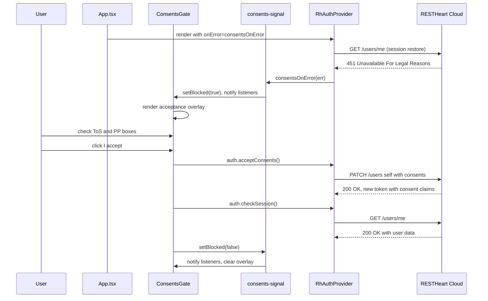

# Auth & Teams

This page documents every authentication and multi-tenancy flow implemented in the starter. All auth logic is provided by `@restheart-cloud/kit-react` through the [`RhAuthProvider`](../architecture/overview.md#auth-provider) and the `useAuth()` hook.

## Authentication Flows

### Login

**Route:** `/auth/login` · **Guard:** `PublicGuard` · **File:** `src/pages/auth/login/Login.tsx`

The login page renders:
1. **OAuth buttons** (if `oauthLogin` feature flag is on) via the `OAuthButtons` component
2. An "OR" divider
3. **Email/password form** with inline validation:
   - Email: must contain `@` (checked on blur)
   - Password: required (checked on blur)
   - Submit calls `auth.login(email, password)`, then `navigate('/')`
   - 401 → "Invalid email or password."
   - Other errors → displays the error message
4. Links to signup (`/auth/signup`) and forgot password (`/auth/forgot-password`)

The page also checks for an `error` search param on load — if `error=invalid_token`, it shows "This link is invalid or has expired." (used when the kit redirects back after a failed OAuth or token flow).

Loading state disables the submit button. Password visibility toggle is provided.

### Signup

**Route:** `/auth/signup` · **Guard:** `PublicGuard` · **Shown when:** `emailRegistration || oauthLogin` · **File:** `src/pages/auth/signup/Signup.tsx`

Registration form collecting first name, last name, email, and password (minimum 8 characters). OAuth buttons are shown above the form when `oauthLogin` is enabled. On submit:

1. Auto-generates a team name: `{firstName}'s Team`
2. Calls `auth.register({ teamName, firstName, lastName, email, password })`
3. On success → shows a "Check your email" confirmation screen (no redirect)
4. On 409 → "An account with this email already exists."

The [`justSignedUp`](#just-signed-up-flag) flag exists in `App.tsx` for cases where an external flow (e.g., OAuth callback) sets `?flow=signup` in the URL, but the signup form itself does not trigger it.

### Email Verification

**Route:** `/auth/verify` · **Guard:** `PublicGuard` · **Shown when:** `emailRegistration` · **File:** `src/pages/auth/verify/Verify.tsx`

Handles the verification link from the signup confirmation email. Reads `email`, `token`, and `error` from URL search params:

1. **Missing params** (`email` or `token` absent) → shows "Invalid link" with a back-to-login link
2. **Error param present** → shows "Verification failed — link is invalid or has expired"
3. **Valid params** → calls `auth.verify(email, token)`, which returns a URL, then redirects the browser to it (`window.location.href = url`)

### Password Reset

**Routes:** `/auth/forgot-password`, `/auth/reset-password` · **Guard:** `PublicGuard` · **Shown when:** `passwordReset`

Two-step flow:
1. **ForgotPassword** (`src/pages/auth/forgot-password/ForgotPassword.tsx`) — user enters email. The API returns 202 regardless of whether the email exists (to avoid leaking registered addresses). On submit → shows "Check your email" confirmation. Calls `auth.forgotPassword(email)`.
2. **ResetPassword** (`src/pages/auth/reset-password/ResetPassword.tsx`) — user clicks email link with `?email=...&token=...` query params. If params are missing → "Invalid link". Otherwise shows a password form (minimum 8 characters). Calls `auth.resetPassword({ email, token, password })`. On 401 → "This reset link is invalid or has expired." On success → navigates to `/`.

### OAuth Login

**File:** `src/pages/auth/oauth-buttons/OAuthButtons.tsx`

OAuth is initiated by navigating to `${apiUrl}/auth/oauth/authorize/${provider}?noauthchallenge`. The `oauthUrl()` helper in `src/oauth-url.ts` builds this URL.

After the OAuth provider authenticates the user, they are redirected back with an access token in the URL **fragment** (`#access_token=...`). The [fragment token capture](../architecture/overview.md#fragment-token-capture) in `App.tsx` picks this up.

**Supported providers:** Configured in `environment.features.oauthProviders` array. Currently `['google']`. Add `'github'` or others as your RESTHeart Cloud service supports them.

## Invitations

**Route:** `/invitations/accept` · **Guard:** none (works signed-in or out) · **Shown when:** `teamInvitations` · **File:** `src/pages/invitations/accept/Accept.tsx`

Invitation links arrive via email with `?email=...&token=...` query params. The page handles three cases:

### Flow 1: Missing Parameters

If `email` or `token` is missing from the URL, an "Invalid invitation link" error is shown immediately.

### Flow 2: New User (not yet registered)

On load, `auth.getInvitation(email, token)` is called. If `invitation.isNewUser === true`:
- Shows "Join {teamName}" heading
- Password form (minimum 8 characters) with inline validation
- Submit calls `auth.activate({ email, token, password })` which both creates the account and accepts the invitation
- On success → navigates to `/`

### Flow 3: Existing User

If `invitation.isNewUser === false`:
- Shows "Accept invitation to {teamName}"
- If already logged in → one-click "Accept" button calls `auth.acceptInvite(token)`
- If not logged in → password form, submit logs in then calls `auth.acceptInvite(token)`
- On success → shows "You're in" and redirects to `/` after 1.2 seconds

Error handling:
- 404 → "This invitation is invalid or has expired."
- 401 → "Invalid password."
- Other → display the error message

## Team Management

**Files:** `src/pages/teams/Teams.tsx`, `src/pages/teams/detail/TeamDetail.tsx`, `src/pages/teams/new/NewTeam.tsx`

### Team List (`/teams`)

- Calls `auth.loadTeams()` on mount
- Renders each team with name, description, role
- Active team gets a "current" badge; inactive teams get a "Switch" button
- "New team" link at top
- Empty state: "You're not part of any team yet."

### Team Switching

`auth.switchTeam(teamId)` — called from the team list. The team switcher in the Shell header is only shown when the user belongs to more than one team.

### Team Detail (`/teams/:id`)

**File:** `src/pages/teams/detail/TeamDetail.tsx`

Full team management page, owner-only sections are gated by `team.role === 'owner'`:

- **Members** — lists all team members with name, email, and role. Owners can change member roles (member ↔ owner) and remove members (with confirmation).
- **Invite a team member** (owner only) — form with email and role selection. Calls `auth.invite(email, role)`. Shows 409 error for duplicate members.
- **Pending invitations** (owner only) — lists pending invites with role, date, and expired status. "Resend" button with a 5-minute cooldown per invite.
- **Team settings** (owner only) — form to edit team name and description. Calls `auth.updateTeam()`.
- **Delete team** (owner only) — confirmation dialog, calls `auth.deleteTeam()`, then loads remaining teams and switches to the first one.

All data loads via `auth.listTeamMembers()` and `auth.listInvitations()` on mount alongside `auth.loadTeams()`.

### New Team (`/teams/new`)

**File:** `src/pages/teams/new/NewTeam.tsx`

Form to create a new team. Calls `auth.createTeam(teamName)` and navigates to `/teams` on success.

## Just-Signed-Up Flag

**File:** `src/just-signed-up.ts`

A simple module-level boolean:
- `setJustSignedUp(true)` is called in `App.tsx` when `?flow=signup` is detected
- Shell reads `isJustSignedUp()` on mount to show a welcome message
- Shell calls `setJustSignedUp(false)` immediately after reading (one-shot)

This avoids passing state through React context for a transient UI effect.

## Consents Gate

The consents gate blocks users who have not accepted the current Terms of Service and Privacy Policy. A server-side Guards rule answers every authenticated request with HTTP `451 Unavailable For Legal Reasons` until the user accepts. The client-side gate detects this and shows an acceptance overlay.

### consents-signal.ts

**File:** `src/consents-signal.ts`

A plain module (no React dependency) that manages the blocked/unblocked state:

| Export | Purpose |
|--------|---------|
| `isBlocked()` | Returns the current boolean flag |
| `setBlocked(next)` | Sets the flag and notifies all listeners (no-op if unchanged) |
| `subscribe(listener)` | Registers a callback; returns an unsubscribe function |
| `consentsOnError(err)` | The `onError` handler passed to `RhAuthProvider` — raises the flag when `err.status === 451` |

The signal is intentionally decoupled from React so that `consentsOnError` can be passed into the provider before any component renders.

### ConsentsGate component

**File:** `src/ConsentsGate.tsx`

`ConsentsGate` sits **above the router** in `App.tsx`, not inside the Shell. This placement is critical: a user who has not accepted has no session — the service answers `451` to `/users/me` too — so `AuthGuard` would bounce them to the login page and they would never see the overlay.

When the signal is blocked, the component replaces the entire app with a modal overlay that contains:

- Two checkboxes: "I have read and accept the Terms of Service" and "I have read and accept the Privacy Policy". Both must be checked to enable the submit button.
- An "I accept" button that calls `auth.acceptConsents()` followed by `auth.checkSession()` to reload the session with the new token containing the consent claims.
- A "Sign out" button that clears the blocked flag and calls `auth.logout()`.

On successful acceptance, `setBlocked(false)` clears the signal and the app renders normally.

### How the gate fires

There is no client-side probe or flag to configure. Session restoration (the very first thing `RhAuthProvider` does on load) calls `GET /users/me`. If the user has not accepted the current consents, the Guards rule answers `451`. Because `main.tsx` passes `consentsOnError` as `onError` to `RhAuthProvider`, the provider calls that handler, which raises the blocked flag in the signal. `ConsentsGate` subscribes to the signal and renders the overlay.

### UX, not enforcement

The overlay is a convenience. Remove it with the browser dev tools and every request still returns `451`. The rule lives on the server; the client cannot bypass it.

### Consents flow sequence



*Consents flow: server blocks unconsented users with 451, client detects and shows overlay, acceptance reloads the session.*

## Feature Flags

**File:** `src/environments/environment.ts`

```typescript
features: {
  emailRegistration: true,    // Enables signup + email verification routes
  passwordReset: true,        // Enables forgot-password + reset-password routes
  oauthLogin: true,           // Enables OAuth buttons on login/signup
  oauthProviders: ['google'], // Which OAuth providers to show
  teamInvitations: true,      // Enables /invitations/accept route
}
```

These flags must match your RESTHeart Cloud service's **Sign-up Mgmt → Features** toggles. When a flag is `false`:
- The corresponding route is removed from the route array
- UI elements (links, buttons) that reference the disabled flow are not rendered

### Preventing drift with rhc setup

`rhc.setup.ts` **imports the same `environment.ts`** the app imports and derives the server-side configuration from it. The flags are stated once: turning `passwordReset` off in the app and re-running `rhc setup` turns it off on the service too, because there is no second place to forget. The `rhc setup --dry-run` command checks whether the service matches and reports any mismatches without writing anything.

See the [rhc setup workflow](../workflows/rhc-setup.md) for the full setup procedure.

## Reading Your Own Data

Everything the starter does talks to `/auth/*`, `/token`, and `/users/me` — the kit handles those. For your application's own collections, use `auth.api()`:

```tsx
import { useAuth } from '@restheart-cloud/kit-react';

function Notes() {
  const auth = useAuth();
  const [notes, setNotes] = useState<unknown[]>([]);

  useEffect(() => {
    auth.api('/notes?pagesize=10')
      .then(res => res.json())
      .then(setNotes)
      .catch((err) => console.error(err));
  }, [auth.api]);

  // ...
}
```

Pass a path, not a full URL. `auth.api()` attaches the bearer token automatically and rejects non-2xx responses with `ApiError({ status, message })`. A plain `fetch` to the same URL is unauthenticated — the service answers 401.

The [Home page](../source-map.md#home) includes a working "Fetch /demo" button that demonstrates this pattern.

## See Also

- [Architecture Overview](../architecture/overview.md) — how the auth provider and routing work
- [Operations & Runbook](../operations/runbook.md) — how to configure feature flags and environment
