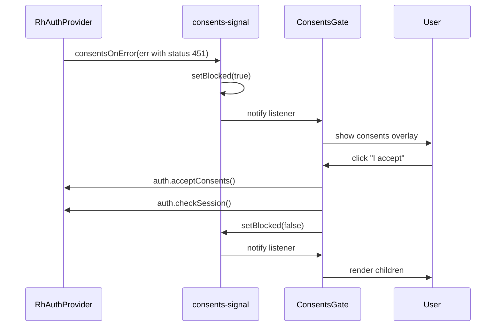

# Testing Guidance

## Current Status

**No test files exist yet.** Vitest is configured as a dependency (`^2.0.0` in `devDependencies`) and the `npm test` script runs `vitest`, but there are no `.test.ts` or `.spec.ts` files in the repository.

## Vitest Setup

Vitest is already configured:

```json
// package.json
{
  "scripts": {
    "test": "vitest"
  },
  "devDependencies": {
    "vitest": "^2.0.0"
  }
}
```

The Vite config (`vite.config.ts`) is minimal — Vitest uses it automatically. No additional Vitest config file is needed to start.

## Recommended Test Strategy

### Unit Tests: Utilities

The simplest targets for initial tests:

| File | What to Test |
|------|-------------|
| `src/just-signed-up.ts` | `setJustSignedUp(true)` → `isJustSignedUp()` returns `true`; reset to `false` returns `false` |
| `src/oauth-url.ts` | `oauthUrl('google')` returns the correct URL pattern |
| `src/consents-signal.ts` | `isBlocked()`/`setBlocked()`/`subscribe()` cycle: setting blocked notifies listeners; setting the same value does not renotify; unsubscribe removes the listener. `consentsOnError()` sets blocked on 451 status but not on other status codes |

The consents signal module exposes a simple observable state pattern: a boolean flag with subscriber notification. The `consentsOnError` function is designed to be passed as `config.onError` to `RhAuthProvider`, where it distinguishes "blocked by consents" (451) from other authentication failures.



*The consents signal flow: 451 errors trigger the gate; accepting consents clears it.*

### Component Tests: Auth Pages

Auth pages have the most logic (form validation, error handling, loading states). Use Vitest + `@testing-library/react`:

| Component | Key Test Cases |
|-----------|---------------|
| `Login` | Renders email/password fields; shows validation errors on blur; handles 401 with specific message; calls `auth.login` on submit; shows OAuth buttons when `oauthLogin` is enabled |
| `Signup` | Form validation (first/last name, email, password min 8 chars); calls `auth.register()`; shows "Check your email" confirmation on success; handles 409 duplicate email; shows OAuth buttons when enabled |
| `Accept` | Missing params → error; new user flow → password form; existing user flow → login + accept; 404 → expired message |
| `ForgotPassword` | Submits email; shows success message |
| `ResetPassword` | Validates token from URL; submits new password |
| `ConsentsGate` | Renders children when not blocked; shows overlay when blocked; accept flow calls `auth.acceptConsents()` then `auth.checkSession()`; sign-out clears the blocked flag and calls `auth.logout()` |

The `ConsentsGate` component sits above the router in the component tree (see [Architecture Overview](/openwiki/architecture/overview.md)). It subscribes to `consents-signal` and renders either its children or a full-screen overlay requiring the user to accept Terms of Service and Privacy Policy. The enforcement lives on the server — removing the overlay in dev tools does not bypass the 451 rule.

### Integration Tests: Routing

Test that routes are correctly gated:

- Unauthenticated user visiting `/home` → redirected to `/auth/login`
- Authenticated user visiting `/auth/login` → redirected to `/`
- Feature flag `passwordReset: false` → `/auth/forgot-password` returns 404/catch-all

### What to Avoid

- Don't test `@restheart-cloud/kit-react` internals — the kit has its own tests
- Don't snapshot-test disposable skin CSS — the starter is designed to be reskinned

## Adding Tests

Create test files alongside source files using the `.test.ts` or `.test.tsx` convention:

```
src/
  just-signed-up.test.ts
  oauth-url.test.ts
  consents-signal.test.ts
  ConsentsGate.test.tsx
  pages/
    auth/
      login/
        Login.test.tsx
```

Run tests:

```bash
npm test          # Watch mode (Vitest default)
npm test -- --run # Single run
```

## See Also

- [Architecture Overview](/openwiki/architecture/overview.md) — understanding the component tree for test setup
- [Operations & Runbook](/openwiki/operations/runbook.md) — build and dev workflow
- [Auth & Teams](/openwiki/domain/auth-and-teams.md) — detailed auth flow documentation for writing accurate test cases
