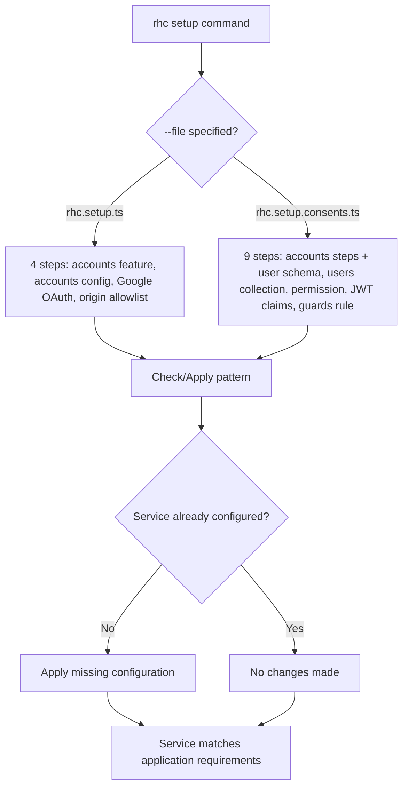

# rhc Setup Automation

This page documents the server-side setup automation implemented by `rhc.setup.ts` and `rhc.setup.consents.ts`. These files configure a RESTHeart Cloud service to match the application's requirements, eliminating configuration drift between client and server.

## Overview

The setup automation uses the `@restheart-cloud/cli` package to provision RESTHeart Cloud services declaratively. Two setup files exist:

- **`rhc.setup.ts`** — configures accounts features only
- **`rhc.setup.consents.ts`** — configures accounts features plus the consents gate

Both files follow an idempotent check/apply pattern: each step verifies whether the desired state exists before applying changes, making the setup safe to run repeatedly.



## rhc.setup.ts — Accounts Configuration

This file provisions the accounts feature and its configuration on a RESTHeart Cloud service. It imports feature flags from `environment.ts` to ensure client and server configurations stay synchronized.

### Feature Flag Derivation

The application's feature flags from `environment.ts` are transformed into server-side toggles:

```typescript
// From environment.ts (client-side)
export const environment = {
  apiUrl: '',
  features: {
    emailRegistration: true,
    passwordReset: true,
    oauthLogin: true,
    oauthProviders: ['google'] as const,
    teamInvitations: true,
  },
};

// Derived server-side toggles
const features = {
  registration: f.emailRegistration,
  verification: f.emailRegistration,  // Two flags for one flow
  'password-reset': f.passwordReset,
  invitations: f.teamInvitations,
  oauth: f.oauthLogin,
};
```

This derivation eliminates the need to maintain separate client and server feature lists.

### Setup Steps

The file defines four idempotent steps:

1. **Accounts feature installed** — ensures the `accounts` plugin is installed on the service
2. **Accounts configured** — sets `app-name`, `frontend-url`, and feature toggles to match the application
3. **Google OAuth credentials** (conditional) — only added when `oauthLogin` is enabled and `google` is in `oauthProviders`
4. **Origin allowlist** — ensures `APP_URL` (from `process.env.APP_URL` or `http://localhost:5173`) is in the service's allowed origins

Each step follows the pattern:
- `check` — returns `true` if the service already matches the desired state
- `apply` — makes the necessary changes if the check fails

### Command Usage

```bash
npm i -D @restheart-cloud/cli
rhc login
rhc setup --srv <srvId> --dry-run    # what is missing
rhc setup --srv <srvId>              # make it so
```

## rhc.setup.consents.ts — Consents Gate

This file extends the accounts setup with the consents gate configuration. It imports `rhc.setup.ts` steps and adds five additional steps to enforce Terms of Service and Privacy Policy acceptance.

### Version Management

Two constants define the current document versions:

```typescript
const TOS_VERSION = '2026-07-01';
const PP_VERSION = '2026-07-01';
```

These versions appear in three places:
1. **Setup file constants** — `TOS_VERSION` and `PP_VERSION`
2. **Guards condition** — derived from these constants
3. **HTML documents** — manual `Version YYYY-MM-DD` line in `public/terms.html` and `public/privacy.html`

When publishing new documents:
1. Update `TOS_VERSION` and/or `PP_VERSION` in the setup file
2. Update the version line in the corresponding HTML file(s)
3. Re-run `rhc setup --srv <srvId> --file rhc.setup.consents.ts`
4. All users will be prompted to accept the new version on their next request

### Setup Steps

The consents setup adds five steps after the accounts steps:

1. **User schema stored** — creates a JSON Schema (`userConsentsSchema`) that validates user documents
2. **Users collection validated** — attaches the schema to the `/users` collection
3. **Acceptance permission** — creates an ACL permission (`userCanPatchOwnConsents`) that allows users to PATCH their own `consents` field
4. **JWT claims** — adds `latestConsents/tos` and `latestConsents/pp` to the token claims
5. **Guards rule** — installs a guard that blocks requests from users who haven't accepted current versions

### The Guards Condition

The condition uses RESTHeart's expression language to block users who haven't accepted both current versions:

```typescript
const CONDITION = [
  "equals(@authenticated, 'true')",           // Only authenticated users
  "not path-prefix('/auth')",                 // Allow auth endpoints
  "not path-prefix('/token')",                // Allow token requests
  "not (method(PATCH) and path-template('/users/{userId}') and bson-request-whitelist(consents))",  // Allow acceptance PATCH
  `not (equals(@user.latestConsents.tos, '${TOS_VERSION}') and equals(@user.latestConsents.pp, '${PP_VERSION}'))`,  // Block if missing or outdated
].join(' and ');
```

Key design decisions:
- **`@authenticated`** excludes anonymous callers without maintaining a list of public paths
- **`/auth` and `/token` exclusions** prevent locked-out users from signing in or refreshing tokens
- **`/users/me` is deliberately NOT excluded** — blocking it is what triggers the client-side acceptance dialog
- **451 status code** — "Unavailable For Legal Reasons" signals the need for document acceptance

### Permission Configuration

The acceptance permission uses `mergeRequest` to stamp versions server-side:

```typescript
const accepted = { tos: TOS_VERSION, pp: PP_VERSION, acceptedAt: '@now' };

// In the permission configuration:
mongo: {
  mergeRequest: {
    latestConsents: accepted,
    _$push: { consents: accepted },  // Append to history
  },
}
```

The server decides what is accepted — the client sends an empty `consents` array, preventing acceptance of unseen terms or backdating.

### Command Usage

```bash
rhc setup --srv <srvId> --file rhc.setup.consents.ts
```

This runs all 9 steps (4 accounts + 5 consents).

## Version Synchronization

Maintaining version consistency across three locations prevents silent failures:

| Location | Purpose | Update Method |
|----------|---------|---------------|
| `TOS_VERSION`/`PP_VERSION` constants | Source of truth for server | Edit and re-run setup |
| Guards condition | Derived from constants | Automatically updated |
| HTML documents | User-facing display | Manual edit |

**Failure mode if versions mismatch:** A user accepts a version, the acceptance is stamped with one version, the guard compares against another, and the user is permanently blocked by a form that says it worked.

## Extension Points

### Adding New Features

To add a new feature flag:
1. Add it to `environment.ts` features object
2. Add the mapping in `rhc.setup.ts` features object
3. Re-run setup

### Customizing the Consents Gate

To modify gate behavior:
- **Change status code**: Modify `status_code` in the guard rule (currently 451)
- **Add more claims**: Extend `CLAIMS` array and update JWT claims step
- **Change blocking logic**: Modify `CONDITION` array (be careful with public path exclusions)

### Environment Variables

- `APP_URL` — Application URL (default: `http://localhost:5173`)
- `APP_NAME` — Display name in emails (default: `RESTHeart Cloud Starter`)
- `GOOGLE_CLIENT_ID` — Google OAuth client ID (resolved only when needed)
- `GOOGLE_CLIENT_SECRET` — Google OAuth client secret (resolved only when needed)

## Troubleshooting

### Common Issues

1. **"451 on all requests"** — Check that `TOS_VERSION`/`PP_VERSION` match between setup file and HTML documents
2. **"Permission denied on acceptance"** — Ensure the `userCanPatchOwnConsents` permission exists
3. **"OAuth redirect error"** — Verify Google credentials are configured and `oauthLogin` is enabled
4. **"CORS errors"** — Check that `APP_URL` is in the origin allowlist

### Dry Run

Always test with `--dry-run` first to see what changes would be made:

```bash
rhc setup --srv <srvId> --file rhc.setup.consents.ts --dry-run
```

This shows which steps need to be applied without making changes.
